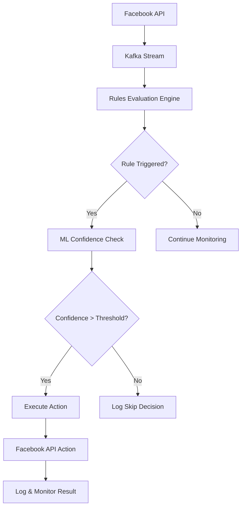
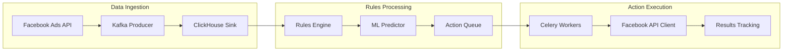

# 🎯 AI-Buyer: Hybrid Rules-ML Facebook Advertising Platform

AI-Buyer - це enterprise платформа для автоматизації Facebook реклами, що поєднує потужність Rules Engine з інтелектом Machine Learning. Розроблена для обробки **100+ клієнтів** та **10,000+ кампаній** одночасно з real-time автоматичним виконанням дій.

## 🏗️ Hybrid Architecture Overview

### **Core: Rules Engine + ML Support**
```
🎛️ Rules Engine (Primary Logic)
├── Rule Definition & Management
├── Real-time Rule Evaluation  
├── Action Execution Engine
└── Rule Performance Analytics

🤖 ML Layer (Supporting Intelligence)
├── Anomaly Detection (статистичне + ML)
├── Performance Prediction (LightGBM)
├── Smart Rule Suggestions (OpenAI API)
└── Pattern Recognition (для нових правил)
```

## 🚀 Key Features

### **Rules Engine (Primary)**
- **Custom Rules**: Гнучке створення бізнес-правил для кампаній
- **Real-time Evaluation**: Миттєва оцінка правил при оновленні метрик
- **Automated Actions**: Автоматичне виконання дій (pause, budget, creative rotation)
- **Rule Performance Tracking**: Аналітика ефективності кожного правила

### **ML Enhancement (Supporting)**
- **Smart Anomaly Detection**: ML + статистичне виявлення аномалій
- **Action Outcome Prediction**: Прогноз ефективності перед виконанням дії
- **Rule Optimization**: ML-based оптимізація параметрів правил
- **Pattern Recognition**: Автоматичні пропозиції нових правил

### **Enterprise Infrastructure**
- **ClickHouse**: Швидкі запити по 10K+ кампаніях
- **Kafka Streaming**: Real-time обробка метрик з Facebook API
- **Redis Cluster**: Кешування правил та сесій
- **Celery Workers**: Масштабовані асинхронні завдання
- **Docker Swarm**: Production orchestration

### **Advanced Monitoring**
- **Real-time Dashboard**: Live моніторинг всіх кампаній та правил
- **Performance Analytics**: Deep dive в ефективність автоматизації
- **Client Reporting**: Персоналізовані звіти для кожного клієнта
- **Alert System**: Інтелектуальні сповіщення та escalation

## 📋 Передумови

## 📊 Technical Stack

### **Backend Services**
```yaml
Core Services:
  Rules Engine:         FastAPI + Python 3.13
  ML Prediction Service: LightGBM + MLflow
  Facebook API Client:   Meta Business SDK
  Action Executor:      Celery Workers
  
Infrastructure:
  Database:            ClickHouse (analytics) + PostgreSQL (transactional)
  Streaming:           Apache Kafka + Zookeeper
  Cache:               Redis Cluster
  Queue:               Celery + Redis Broker
  Monitoring:          Prometheus + Grafana
```

### **Frontend Stack**
```yaml
Framework:            React 18 + TypeScript
Build Tool:           Vite
UI Library:           Shadcn/UI + TailwindCSS
State Management:     Zustand
Data Fetching:        React Query
Charts:               Recharts + Plotly.js
```

### **ML Infrastructure**
```yaml
Training:             MLflow + Jupyter
Models:               LightGBM, Prophet, scikit-learn
Feature Store:        ClickHouse materialized views
Model Serving:        FastAPI + uvicorn
Experimentation:      A/B testing framework
```

### **DevOps & Production**
```yaml
Containerization:     Docker + Docker Compose
Orchestration:        Docker Swarm / Kubernetes
CI/CD:                GitHub Actions
Monitoring:           Prometheus + Grafana + AlertManager
Logging:              ELK Stack (Elasticsearch + Logstash + Kibana)
Load Balancing:       Nginx + HAProxy
```

## 🏗️ Architecture Deep Dive

### **Rules Engine Flow**


### **Data Flow Architecture**


## 📋 System Requirements

### **Production Environment**
- **CPU**: 16+ cores (Intel Xeon або AMD EPYC)
- **Memory**: 64GB+ RAM
- **Storage**: 1TB+ NVMe SSD (database), 500GB+ SSD (logs)
- **Network**: 1Gbps+ bandwidth
- **OS**: Ubuntu 22.04 LTS або RHEL 9

### **Development Environment**
- **CPU**: 8+ cores
- **Memory**: 16GB+ RAM  
- **Storage**: 100GB+ SSD
- **OS**: macOS, Ubuntu, або Windows з WSL2

### **External Dependencies**

- **Facebook Marketing API**: Business Manager access
- **ClickHouse Cloud**: Або self-hosted cluster  
- **Redis Cloud**: Або self-hosted cluster
- **Kafka**: Confluent Cloud або self-hosted
- **MLflow Tracking Server**: For model management

## 🚀 Quick Start

### **1. Local Development Setup**

```bash
# Clone repository
git clone https://github.com/your-org/ai-buyer.git
cd ai-buyer

# Setup environment
cp .env.development .env.local
# Edit .env.local with your Facebook API credentials

# Start with ML support
./start-local.sh
```

**Access URLs:**
- Frontend: http://localhost:8080
- Backend API: http://localhost:8000  
- API Docs: http://localhost:8000/docs
- ML Models Status: http://localhost:8000/api/v1/models/status

### **2. Production Deployment**

```bash
# Production environment setup
cp .env.production .env
# Configure production variables

# Deploy with Docker Swarm
docker swarm init
docker stack deploy -c docker-compose.prod.yml ai-buyer

# Or with Kubernetes
kubectl apply -f k8s/
```

### **3. Configuration**

#### **Facebook API Setup**
```bash
# Required environment variables:
FACEBOOK_APP_ID=your_app_id
FACEBOOK_APP_SECRET=your_app_secret  
FACEBOOK_ACCESS_TOKEN=your_access_token
FACEBOOK_AD_ACCOUNT_ID=your_ad_account_id
```

#### **Database Configuration**
```bash
# ClickHouse
CLICKHOUSE_HOST=localhost
CLICKHOUSE_PORT=9000
CLICKHOUSE_DATABASE=ai_buyer

# PostgreSQL (for rules storage)
POSTGRES_HOST=localhost
POSTGRES_DATABASE=ai_buyer_rules
POSTGRES_USER=ai_buyer
POSTGRES_PASSWORD=secure_password
```

#### **Kafka Streaming**
```bash
KAFKA_BOOTSTRAP_SERVERS=localhost:9092
KAFKA_TOPIC_PREFIX=ai_buyer
KAFKA_CONSUMER_GROUP=ai_buyer_rules_engine
```

## 🎯 Usage Examples

### **Creating a Performance Rule**

```python
# Example: Auto-pause low-performing campaigns
rule = {
    "name": "Auto-pause Low CTR Campaigns",
    "conditions": [
        {
            "metric": "ctr",
            "operator": "<", 
            "value": 1.0,
            "time_window": "24h",
            "min_impressions": 1000
        }
    ],
    "actions": [
        {
            "type": "pause_campaign",
            "params": {"reason": "Low CTR performance"}
        },
        {
            "type": "notify_client", 
            "params": {"message": "Campaign paused due to low CTR"}
        }
    ],
    "ml_enhancement": {
        "use_prediction": True,
        "confidence_threshold": 0.8
    }
}

# Create rule via API
response = requests.post(
    "http://localhost:8000/api/v1/rules", 
    json=rule,
    headers={"Authorization": f"Bearer {access_token}"}
)
```

### **Monitoring Rule Performance**

```bash
# Get all active rules
curl "http://localhost:8000/api/v1/rules?status=active" | jq .

# Check rule execution history  
curl "http://localhost:8000/api/v1/rules/{rule_id}/executions" | jq .

# View rule performance metrics
curl "http://localhost:8000/api/v1/rules/{rule_id}/performance" | jq .
```

### **ML-Enhanced Decision Making**

```python
# Example: Smart budget reallocation with ML prediction
rule = {
    "name": "Smart Budget Optimization",
    "conditions": [
        {
            "metric": "roas",
            "operator": ">", 
            "value": 3.0,
            "time_window": "7d"
        }
    ],
    "actions": [
        {
            "type": "increase_budget",
            "params": {
                "increase_by_percent": 20,
                "max_daily_budget": 1000
            }
        }
    ],
    "ml_enhancement": {
        "use_prediction": True,
        "prediction_horizon": "7d",
        "confidence_threshold": 0.75,
        "fallback_to_rule": True
    }
}
```

## 📊 Performance Benchmarks

### **System Throughput**
- **Rules Evaluation**: 1,000+ campaigns/second
- **Action Execution**: 100+ actions/second  
- **Data Ingestion**: 10,000+ events/second
- **ML Predictions**: 500+ predictions/second

### **Latency Targets**
- **Rule Evaluation**: <100ms p95
- **Facebook API Actions**: <5s p95
- **Dashboard Loading**: <2s p95
- **Real-time Updates**: <1s p95

### **Scalability**
- **Campaigns**: 10,000+ concurrent
- **Clients**: 100+ simultaneous  
- **Rules**: 1,000+ active rules
- **Daily Events**: 10M+ processed

## 🛠 Development Workflow

### **Local Development**

```bash
# Start development environment
./start-local.sh

# Run tests
make test

# Code quality checks
make lint
make type-check

# Database migrations
make migrate

# Stop services
./stop-local.sh
```

### **Testing Strategy**

```bash
# Unit tests
pytest backend/tests/unit/

# Integration tests  
pytest backend/tests/integration/

# End-to-end tests
npm run test:e2e

# Load testing
make load-test

# ML model validation
python -m pytest backend/tests/ml/
```

### **Code Quality**

```bash
# Backend (Python)
black backend/          # Code formatting
flake8 backend/         # Linting  
mypy backend/           # Type checking
safety check            # Security audit

# Frontend (TypeScript)
npm run lint            # ESLint
npm run type-check      # TypeScript
npm run audit           # Security audit
```

## 🔍 Monitoring & Observability

### **Application Metrics**
- **Rules Engine**: Evaluation latency, success rate, action execution times
- **ML Models**: Prediction accuracy, inference latency, model drift detection
- **Facebook API**: Rate limits, success rates, response times
- **System Health**: CPU, memory, disk usage, network throughput

### **Business Metrics**
- **Campaign Performance**: CTR improvements, ROAS optimization, cost savings
- **Rule Effectiveness**: Success rate per rule, ROI impact, client satisfaction
- **System Efficiency**: Automated actions vs manual interventions

### **Alerting Rules**

```yaml
# Example Prometheus alerting rules
groups:
  - name: ai-buyer-rules-engine
    rules:
      - alert: HighRuleEvaluationLatency
        expr: histogram_quantile(0.95, rules_evaluation_duration_seconds) > 0.1
        for: 5m
        labels:
          severity: warning
        annotations:
          summary: "Rule evaluation latency is high"
          
      - alert: FacebookAPIRateLimitApproaching  
        expr: facebook_api_rate_limit_remaining < 100
        for: 1m
        labels:
          severity: critical
        annotations:
          summary: "Facebook API rate limit approaching"
```

## 📚 Documentation

### **API Documentation**
- **Interactive API Docs**: http://localhost:8000/docs
- **OpenAPI Specification**: `/api/v1/openapi.json`
- **Postman Collection**: `docs/postman/ai-buyer.json`

### **Architecture Documentation**
- **System Design**: `docs/architecture/system-design.md`
- **Database Schema**: `docs/database/schema.md`  
- **Rules Engine Guide**: `docs/rules-engine/README.md`
- **ML Models Guide**: `docs/ml/models.md`

### **Deployment Guides**
- **Local Setup**: `docs/deployment/local.md`
- **Production Deployment**: `docs/deployment/production.md`
- **Kubernetes Deployment**: `docs/deployment/kubernetes.md`
- **Monitoring Setup**: `docs/monitoring/setup.md`

## 🔒 Security

### **Authentication & Authorization**
- **OAuth 2.0**: Facebook API integration
- **JWT Tokens**: API authentication
- **RBAC**: Role-based access control
- **API Keys**: Service-to-service authentication

### **Data Protection**
- **Encryption**: TLS 1.3 in transit, AES-256 at rest
- **PII Handling**: GDPR compliant data processing
- **Access Logs**: Comprehensive audit trails
- **Rate Limiting**: DDoS protection and abuse prevention

### **Security Monitoring**
- **Vulnerability Scanning**: Regular dependency audits
- **Penetration Testing**: Quarterly security assessments  
- **Compliance**: SOC 2 Type II, GDPR, CCPA
- **Incident Response**: 24/7 security monitoring

## 🤝 Contributing

### **Development Setup**

```bash
# Fork and clone the repository
git clone https://github.com/your-username/ai-buyer.git
cd ai-buyer

# Create feature branch
git checkout -b feature/your-feature-name

# Install pre-commit hooks
pre-commit install

# Make your changes and test
make test
make lint

# Submit pull request
git push origin feature/your-feature-name
```

### **Contribution Guidelines**
- Follow the [Code Style Guide](docs/development/code-style.md)
- Write comprehensive tests for new features
- Update documentation for API changes
- Follow [Conventional Commits](https://conventionalcommits.org/) format

## 📄 License

This project is licensed under the MIT License - see the [LICENSE](LICENSE) file for details.

## 🆘 Support

### **Community Support**
- **GitHub Issues**: Bug reports and feature requests
- **Discussions**: Community Q&A and ideas
- **Wiki**: Community-maintained documentation

### **Enterprise Support**
- **Professional Services**: Custom implementation and consulting
- **SLA Support**: 24/7 support with guaranteed response times
- **Training**: On-site and remote training programs

### **Contact**
- **Email**: support@ai-buyer.com
- **Slack**: [AI-Buyer Community](https://ai-buyer.slack.com)
- **Website**: https://ai-buyer.com

---

**Built with ❤️ for the advertising automation community**

*AI-Buyer combines the reliability of rules-based automation with the intelligence of machine learning to deliver enterprise-grade Facebook advertising optimization at scale.*

## 🛠 Налаштування та запуск

### 1. Клонування репозиторію

```bash
git clone <repository-url>
cd ai-buyer
```

### 2. Налаштування середовища

```bash
# Копіюйте приклад конфігурації
cp .env.development .env.local

# Відредагуйте .env.local з вашими налаштуваннями
nano .env.local
```

### 3. Налаштування Facebook API

Додайте ваші дані Facebook API у `.env.local`:

```bash
FACEBOOK_APP_ID=your_app_id_here
FACEBOOK_APP_SECRET=your_app_secret_here
```

### 4. Запуск через Docker Compose

```bash
# Збірка та запуск всіх сервісів
docker-compose up -d

# Перегляд логів
docker-compose logs -f

# Зупинка сервісів
docker-compose down
```

### 5. Ініціалізація бази даних

```bash
# Запуск міграцій ClickHouse
docker-compose exec backend python -m alembic upgrade head

# Або вручну
docker-compose exec clickhouse clickhouse-client < backend/migrations/001_clickhouse_schema.sql
```

## 🌐 Доступ до сервісів

### Основні сервіси

- **Frontend**: <http://localhost:3000>
- **Backend API**: <http://localhost:8000>
- **API Documentation**: <http://localhost:8000/docs>

### Моніторинг та адміністрування

- **ClickHouse**: <http://localhost:8123>
- **Kafka UI**: <http://localhost:8080>
- **MLflow**: <http://localhost:5000>
- **MinIO**: <http://localhost:9001>
- **Prometheus**: <http://localhost:9090>
- **Grafana**: <http://localhost:3001> (admin/admin)

### Development Tools

- **Redis**: localhost:6379
- **Kafka**: localhost:9092

## 🔧 Локальна розробка

### Backend розробка

```bash
cd backend

# Створіть віртуальне середовище
python -m venv venv
source venv/bin/activate  # Linux/Mac
# або
venv\\Scripts\\activate  # Windows

# Встановіть залежності
pip install -r requirements.txt

# Запустіть сервер розробки
uvicorn api.main:app --reload --host 0.0.0.0 --port 8000
```

### Frontend розробка

```bash
cd frontend

# Встановіть залежності
npm install

# Запустіть сервер розробки
npm run dev
```

### Celery Worker (для ML задач)

```bash
cd backend

# Запустіть Celery worker
celery -A backend.tasks.celery_app worker --loglevel=info --concurrency=4

# Запустіть Celery beat (для планувальника)
celery -A backend.tasks.celery_app beat --loglevel=info
```

## 📊 Використання ML функцій

### CTR Prediction

```python
from backend.ml.models.ctr_predictor import CTRPredictor

predictor = CTRPredictor()
features = {
    'age_range': '25-34',
    'gender': 'all',
    'device_platform': 'mobile',
    'bid_amount': 1.50,
    'ad_relevance_score': 8
}

prediction = predictor.predict(features)
print(f"Predicted CTR: {prediction['ctr_prediction']:.4f}")
```

### Budget Optimization

```python
from backend.ml.models.budget_optimizer import BudgetOptimizer

optimizer = BudgetOptimizer()
campaigns = [
    {'campaign_id': 'camp1', 'current_budget': 100},
    {'campaign_id': 'camp2', 'current_budget': 200}
]

recommendations = optimizer.optimize_budget_allocation(campaigns)
print(f"Optimization complete: {len(recommendations)} recommendations")
```

### Real-time Streaming

```python
from backend.services.streaming_service import get_streaming_service

# Відправка даних кампанії
service = get_streaming_service()
await service.stream_campaign_data(
    user_id="user123",
    campaigns_data=[campaign_metrics]
)
```

## 🔍 Моніторинг та логи

### Перегляд логів

```bash
# Всі сервіси
docker-compose logs -f

# Конкретний сервіс
docker-compose logs -f backend
docker-compose logs -f frontend
docker-compose logs -f celery-worker
```

### Метрики продуктивності

- **Grafana Dashboard**: <http://localhost:3001>
- **Prometheus Metrics**: <http://localhost:9090>
- **ML Model Metrics**: <http://localhost:5000> (MLflow)

### Health Checks

```bash
# Backend health
curl http://localhost:8000/health

# ML models status
curl http://localhost:8000/api/v1/ml/health

# Database status
curl http://localhost:8123/ping
```

## 🧪 Тестування

### Backend тести

```bash
cd backend
pytest tests/ -v --cov=backend
```

### Frontend тести

```bash
cd frontend
npm run test
npm run test:coverage
```

### Integration тести

```bash
# Запустіть повний тестовий стек
docker-compose -f docker-compose.test.yml up --abort-on-container-exit
```

## 📖 API Документація

### ML API Endpoints

- `POST /api/v1/ml/predict/ctr` - CTR прогнозування
- `POST /api/v1/ml/optimize/budget` - Оптимізація бюджету
- `GET /api/v1/ml/detect/anomalies` - Виявлення аномалій
- `GET /api/v1/ml/models` - Список ML моделей

### Campaign API Endpoints

- `GET /api/v1/campaigns` - Список кампаній
- `POST /api/v1/campaigns` - Створення кампанії
- `PUT /api/v1/campaigns/{id}` - Оновлення кампанії
- `GET /api/v1/campaigns/{id}/metrics` - Метрики кампанії

### Analytics API Endpoints

- `GET /api/v1/analytics/dashboard` - Dashboard дані
- `GET /api/v1/analytics/performance` - Аналіз продуктивності
- `GET /api/v1/analytics/trends` - Аналіз трендів

## 🚀 Продакшн деплой

### AWS/GCP/Azure

```bash
# Налаштуйте змінні середовища для продакшну
export ENVIRONMENT=production
export CLICKHOUSE_HOST=your-clickhouse-host
export KAFKA_BOOTSTRAP_SERVERS=your-kafka-cluster
export MLFLOW_TRACKING_URI=your-mlflow-server

# Деплой з Docker
docker-compose -f docker-compose.prod.yml up -d
```

### Kubernetes

```bash
# Застосуйте Kubernetes конфігурації
kubectl apply -f k8s/

# Перевірте статус
kubectl get pods -n ai-buyer
```

## 🛡 Безпека

### Рекомендації

- Змініть всі паролі за замовчуванням
- Використовуйте HTTPS у продакшні
- Налаштуйте брандмауер для обмеження доступу
- Регулярно оновлюйте залежності
- Увімкніть аудит API запитів

### Аутентифікація

```bash
# Генерація JWT секретного ключа
openssl rand -base64 32

# Додайте до .env.local
JWT_SECRET=your-generated-secret
```

## 📈 Масштабування

### Horizontal Scaling

- Додайте більше Celery workers для ML задач
- Масштабуйте Kafka partitions для більшого throughput
- Використовуйте ClickHouse кластер для великих обсягів даних

### Performance Optimization

- Налаштуйте connection pooling
- Увімкніть кешування Redis
- Оптимізуйте ClickHouse запити
- Використовуйте CDN для статичних файлів

## 🤝 Контрибюція

1. Fork репозиторій
2. Створіть feature branch (`git checkout -b feature/amazing-feature`)
3. Commit зміни (`git commit -m 'Add amazing feature'`)
4. Push до branch (`git push origin feature/amazing-feature`)
5. Відкрийте Pull Request

## 📄 Ліцензія

Цей проект ліцензовано під MIT License - дивіться [LICENSE](LICENSE) файл для деталей.

## 📞 Підтримка

- 📧 Email: <support@ai-buyer.com>
- 💬 Discord: [AI-Buyer Community](https://discord.gg/ai-buyer)
- 📖 Documentation: [docs.ai-buyer.com](https://docs.ai-buyer.com)
- 🐛 Issues: [GitHub Issues](https://github.com/ai-buyer/ai-buyer/issues)

## 🙏 Подяки

- [DeepCTR](https://github.com/shenweichen/DeepCTR) - За CTR prediction моделі
- [Prophet](https://facebook.github.io/prophet/) - За time series forecasting
- [FastAPI](https://fastapi.tiangolo.com/) - За чудовий API framework
- [ClickHouse](https://clickhouse.com/) - За високопродуктивну аналітичну БД
